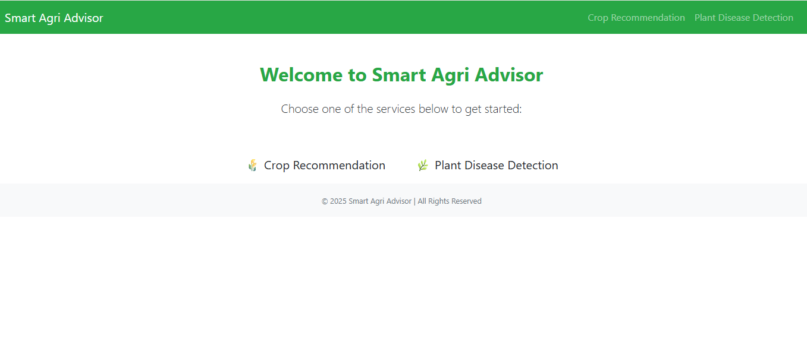
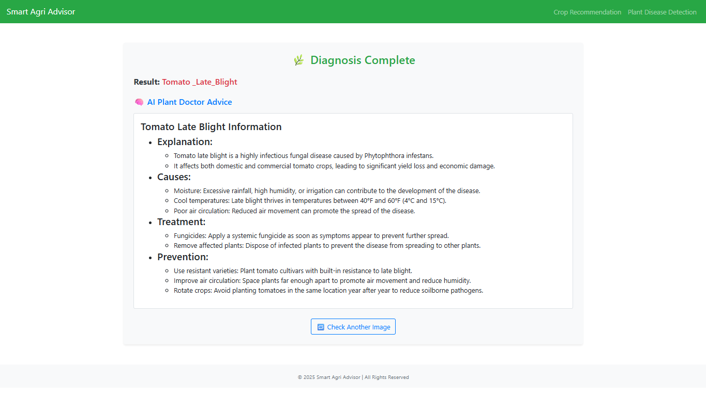
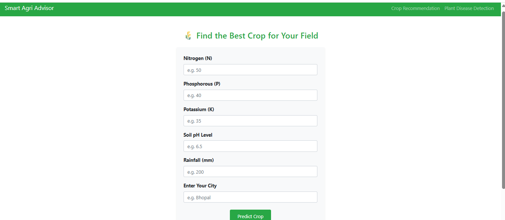
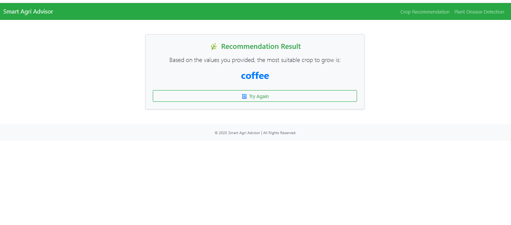

# 🌱 Smart Farm AI Assistant

### AI-Powered Plant Disease Detection + Crop Recommendation System

---

## 🚀 Overview

**Smart Farm AI Assistant** is a complete AI-driven agriculture solution that helps farmers and users:

* 🌿 Detect plant diseases from images
* 🧠 Get intelligent treatment advice (AI Plant Doctor)
* 🌾 Receive **crop recommendations based on environmental conditions**

This project combines **Deep Learning + Generative AI + Data-driven recommendations** into a single system.

---

## ✨ Key Features

### 📸 1. Plant Disease Detection

* Upload a leaf image
* CNN model predicts the disease

---

### 🧠 2. AI Plant Doctor (LangChain Integration)

After prediction, the system generates:

* Disease explanation
* Causes
* Treatment steps
* Prevention tips

👉 Powered by LLM via LangChain

---

### 🌾 3. Crop Recommendation System

Recommends the most suitable crop based on:

* Soil parameters
* Temperature
* Humidity
* Rainfall

👉 Helps users make **data-driven farming decisions**

---

### 🌦️ 4. Weather Integration

* Fetches real-time weather data
* Enhances recommendations and insights

---

### 🌐 5. Web Application

* Built with Flask
* Simple and interactive UI

---

## 🧠 System Architecture

```text
Image Input / Environmental Data
            ↓
    CNN Model / ML Model
            ↓
   Prediction (Disease / Crop)
            ↓
     LangChain + LLM
            ↓
 Actionable Advice & Insights
```

---

## 🛠️ Tech Stack

**Machine Learning**

* TensorFlow / Keras (CNN for disease detection)
* ML model for crop recommendation

**LLM Layer**

* LangChain
* Groq / OpenAI APIs

**Backend**

* Flask

**Frontend**

* HTML, CSS, Bootstrap

**Utilities**

* Python-dotenv

---

## 📂 Project Structure

```text
Smart_Farm_AI_Assistant/
│── app/
│   ├── app.py
│   ├── plant_doctor.py
│   ├── model/
│   ├── templates/
│   ├── static/
│   └── ...
│
│── .env              # ignored (API keys)
│── .gitignore
│── requirements_updated.txt
```

---

## 🔐 Environment Setup

Create a `.env` file:

```env
GROQ_API_KEY=your_groq_api_key
WEATHER_API_KEY=your_weather_api_key
```

---

## ⚙️ Installation

```bash
git clone https://github.com/mlaxmi1304/Smart_Farm_AI_Assistant.git
cd Smart_Farm_AI_Assistant

python -m venv venv
venv\Scripts\activate

pip install -r requirements_updated.txt
python app/app.py
```

---

## 📊 Models Used

### 🌿 Plant Disease Model

* CNN trained on PlantVillage dataset
* Multi-class classification

### 🌾 Crop Recommendation Model

* Trained on agricultural dataset
* Inputs: soil + environmental parameters
* Output: best crop suggestion

---

## 📸 Screenshots

<p align="center">
  
  
</p>

<p align="center">
  
  
</p>


---

## 💡 Future Enhancements

* 🌍 Multilingual support (Hindi)
* 🎤 Voice-based assistant
* 📚 RAG-based agricultural knowledge
* 📱 Mobile app version

---

## 🧠 Learning Outcomes

* Integration of **ML + LLM systems**
* Building **end-to-end AI applications**
* Real-world **AgriTech problem solving**
* Secure API handling

---

## 👩‍💻 Author

**Mahalaxmi Pandey**

---

## ⭐ Support

If you like this project, give it a ⭐ and share your feedback!
